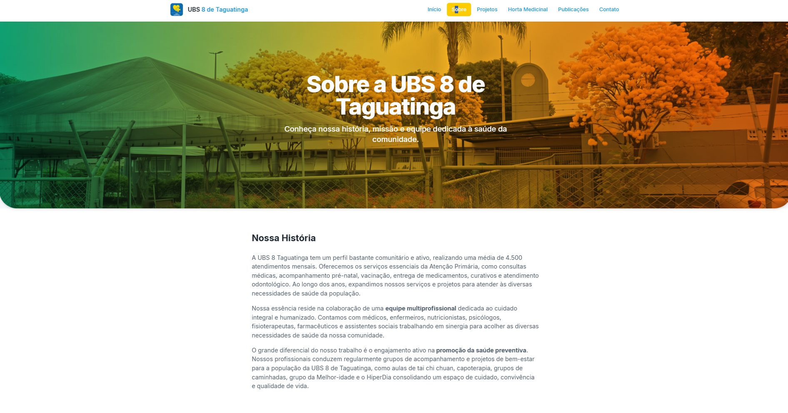
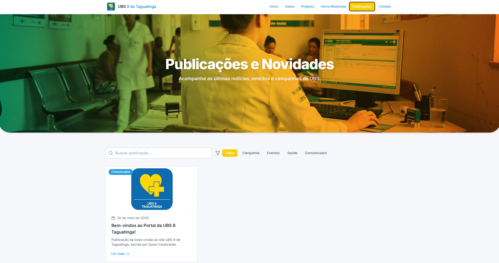
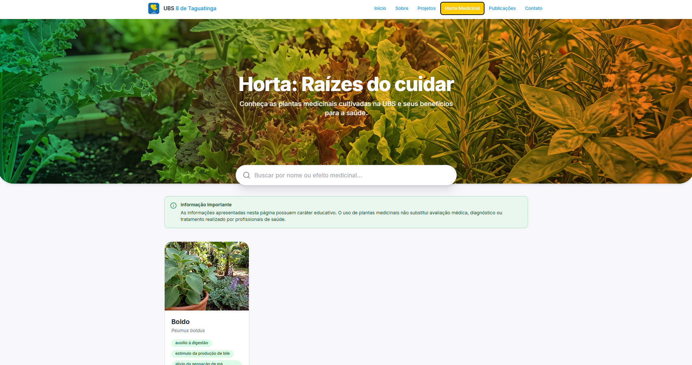
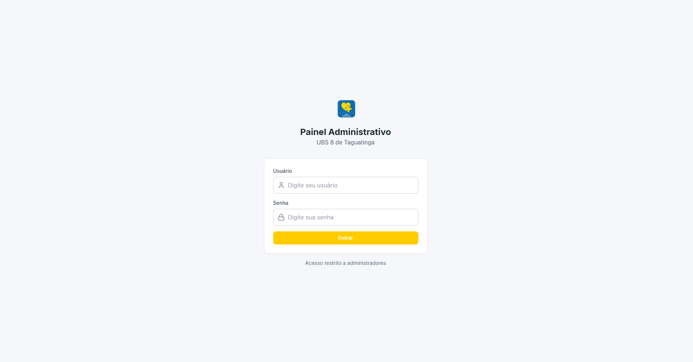
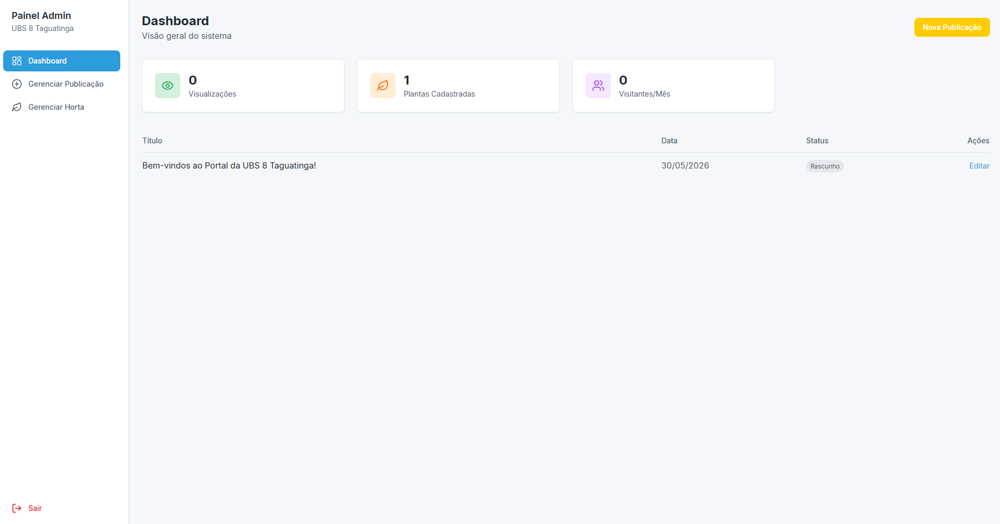
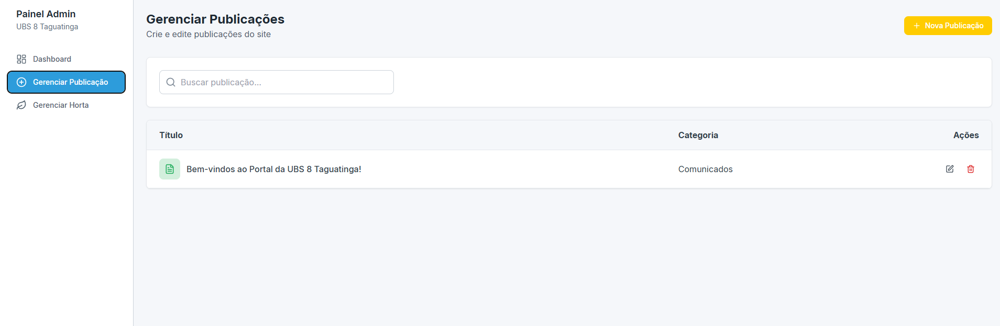
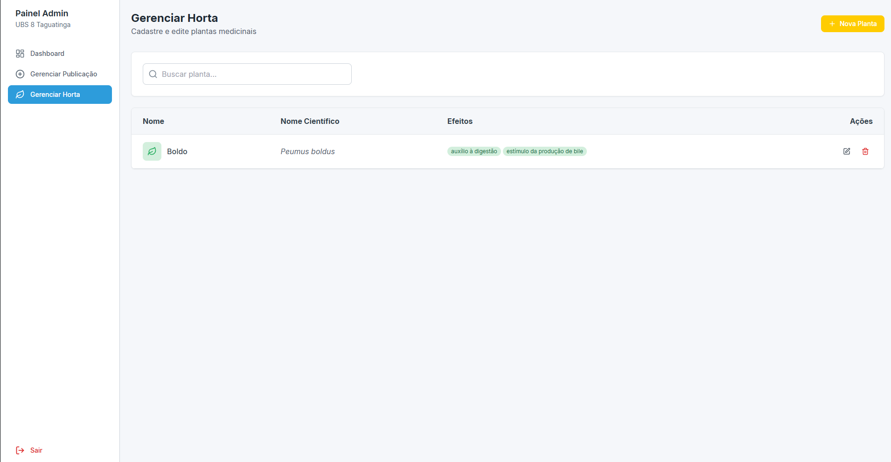

<p align="center">
  
</p>

<h1 align="center">
  UBS 8 de Taguatinga - Sistema Web
</h1>

<p align="center">
  Sistema web full stack desenvolvido para auxiliar na divulgação de projetos, publicações e iniciativas comunitárias da UBS 8 de Taguatinga.
</p>

<p align="center">
  <a href="https://vercel.com/projetos-deploy-dylancavalcante/ubs-8-taguatinga">Frontend</a>
  •
  <a href="https://railway.com/project">Backend</a>
  •
  <a href="https://cloudinary.com">Cloudinary</a>
</p>

<p align="center">


</p>

---

## Sobre o Projeto

O UBS 8 de Taguatinga é um sistema web full stack desenvolvido para auxiliar na divulgação de projetos, publicações e iniciativas comunitárias promovidas pela Unidade Básica de Saúde 8 de Taguatinga, no Distrito Federal.

A plataforma oferece uma área pública para consulta de informações pelos visitantes e um painel administrativo para gerenciamento de conteúdos.

# Demonstração do Sistema

## Área Pública

### Página Inicial

<p align="center">
  
</p>

### Sobre a UBS

<p align="center">
  
</p>

### Publicações

<p align="center">
  
</p>

### Projetos Comunitários

<p align="center">
  
</p>

### Horta Medicinal

<p align="center">
  
</p>

---

## Painel Administrativo

### Login

<p align="center">
  
</p>

### Dashboard

<p align="center">
  
</p>

### Gerenciamento de Publicações

<p align="center">
  
</p>

### Gerenciamento da Horta Medicinal

<p align="center">
  
</p>

---

## Objetivos

- Aplicar conceitos de desenvolvimento Full Stack;
- Implementar integração entre Frontend e Backend;
- Construir e consumir APIs REST;
- Utilizar arquitetura em camadas;
- Gerenciar banco de dados relacional;
- Desenvolver interfaces modernas e responsivas;
- Simular um ambiente real de desenvolvimento de software.

---

# Tecnologias Utilizadas

## Frontend

- React
- Vite
- Tailwind CSS
- React Router DOM
- Axios
- Lucide React

## Backend

- FastAPI
- SQLAlchemy
- PostgreSQL
- Pydantic
- Uvicorn

## Infraestrutura

- Cloudinary
- Railway
- Vercel

---

# Funcionalidades

## Área Pública

- Página inicial institucional
- Exibição de publicações
- Página de detalhes das publicações
- Projetos comunitários
- Horta medicinal
- Página de contato

## Painel Administrativo

- Login administrativo
- Dashboard
- Criação de publicações
- Gerenciamento de conteúdo
- Gerenciamento da horta medicinal
- Upload de imagens com Cloudinary

---

# Arquitetura do Sistema

## Frontend

```text
frontend/
└── src/
    ├── components/
    ├── pages/
    ├── routes/
    └── services/
```

## Backend

```text
backend/
└── app/
    ├── core/
    ├── services/
    ├── controllers/
    ├── database/
    ├── models/
    ├── routes/
    ├── schemas/
    └── main.py
```

---

# Banco de Dados

O sistema utiliza PostgreSQL para armazenamento persistente dos dados.

### Tabela: admins

| Campo | Tipo |
|---------|---------|
| admin_id | Integer |
| usuario | Varchar |
| senha | Varchar |

### Tabela: Publicacao

| Campo | Tipo |
|---------|---------|
| publicacao_id | Integer |
| titulo | Text |
| resumo | Text |
| conteudo | Text |
| imagem_url | Text |
| criado_em | Timestamp |
| admin_id | Integer |

### Tabela: Publicacao_Horta

| Campo | Tipo |
|---------|---------|
| horta_id | Integer |
| nome | Text |
| nome_cientifico | Text |
| descricao | Text |
| modo_de_uso | Text |
| contraindicacoes | Text |
| efeitos | Text |
| imagem_horta_url | Text |
| admin_id | Integer |

---

# API REST

## Publicações

### Listar Publicações

```http
GET /publicacoes/
```

### Criar Publicação

```http
POST /publicacoes/
```

### Excluir Publicação

```http
DELETE /publicacoes/{id}
```

---

# Como Executar o Projeto

## Backend

```bash
cd backend
python -m venv venv
venv\Scripts\activate
pip install -r requirements.txt
uvicorn app.main:app --reload
```

Backend:

```text
http://127.0.0.1:8000
```

Swagger:

```text
http://127.0.0.1:8000/docs
```

## Frontend

```bash
cd frontend
npm install
npm run dev
```

Frontend:

```text
http://localhost:5173
```

---

# Fluxo de Funcionamento

1. O administrador realiza login.
2. O painel administrativo libera acesso às funcionalidades.
3. Publicações e plantas medicinais são cadastradas.
4. Imagens são enviadas para o Cloudinary.
5. Os dados são armazenados no PostgreSQL.
6. A API FastAPI disponibiliza os dados.
7. O frontend React consome a API.

---

# Deploy

## Frontend

- Vercel

## Backend

- Railway

## Armazenamento de Imagens

- Cloudinary

---

# Estrutura do Projeto

```text
ubs8_site/
│
├── backend/
│   ├── app/
│   │   ├── core/
│   │   ├── services/
│   │   ├── controllers/
│   │   ├── database/
│   │   ├── models/
│   │   ├── routes/
│   │   ├── schemas/
│   │   └── main.py
│   │
│   └── requirements.txt
│
├── frontend/
│   ├── src/
│   │   ├── components/
│   │   ├── pages/
│   │   ├── routes/
│   │   └── services/
│   │
│   └── package.json
│
└── README.md
```

---

# Licença

Projeto desenvolvido para fins acadêmicos e educacionais.
